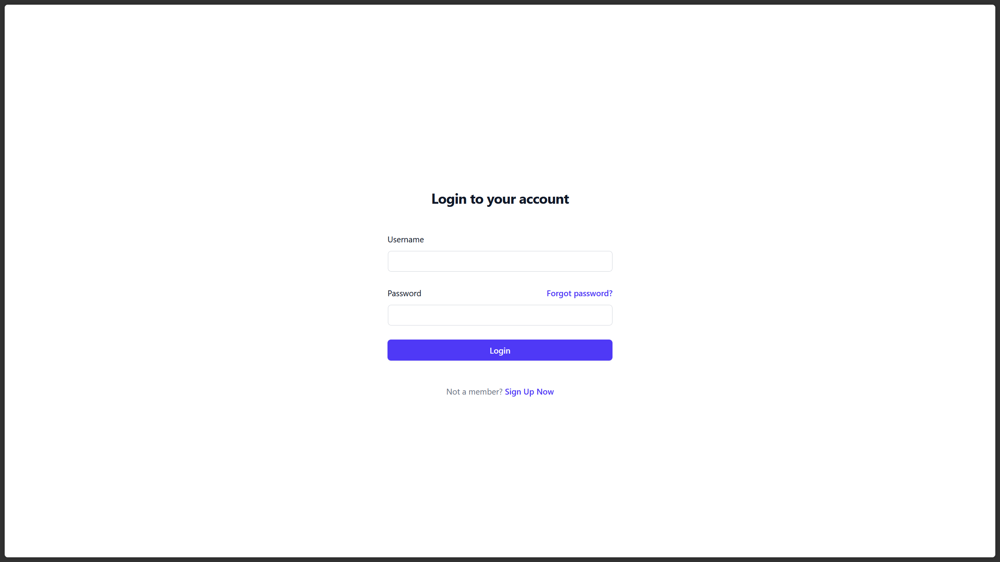
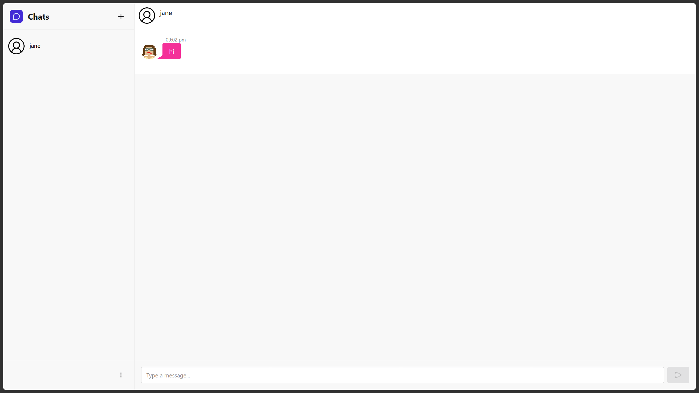
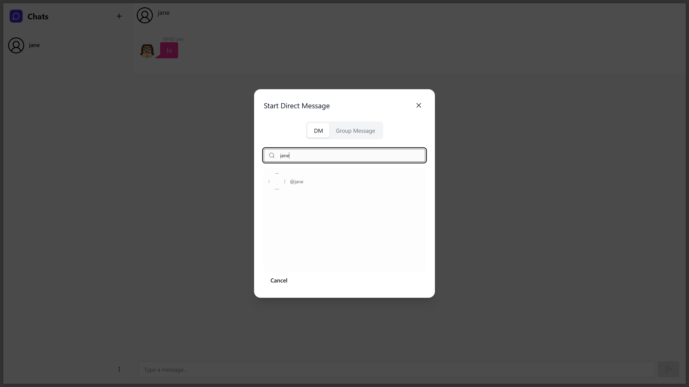

# ChatSecureV2
<br />

A full-stack, end-to-end encrypted chat application with real-time messaging, built with Node.js/Express and React/Vite.

It uses JWT for authentication(access,refresh token), AES for encryption and ECDH for Asynchronous keys exchange. 

ChatSecureV1 can be found (here)[https://github.com/Yoganand20/chatsecure-backend]



&nbsp;
<br />
# Table of Contents
  - [Features](#features)
  - [Tech Stack](#tech-stack)
  - [Installation](#installation)
  - [Credits](#credits)
  - [Contribution](#contribution)


## Features

  End-to-End Encryption: AES encryption with Diffie–Hellman–derived shared secrets.

  Simultaneous Key Exchange: Both clients broadcast public keys immediately to reduce handshake latency.

  Real-Time Messaging: Powered by Socket.IO.

  Ephemeral Message Storage: Messages are stored on server until delivery (or up to 15 days if undelivered).

  User Authentication: JWT-based sessions with bcrypt-hashed passwords.

  Group & Private Chats

  Offline Support: IndexedDB caching with Dexie.js.

## Tech Stack

    Backend: Node.js, Express, Mongoose, Socket.IO

    Frontend: React, Vite, Tailwind CSS, DaisyUI, Zustand

    Database: MongoDB

    Auth & Security: bcrypt, JSON Web Tokens, dotenv

    Offline Caching: Dexie.js

## Installation
### Prerequisites

    Node.js v16+

    npm v8+

    MongoDB instance (local or cloud)

### Setup
 ```sh
git clone https://github.com/Yoganand20/ChatSecureV2.git
cd ChatSecureV2
 ```

#### Backend
 ```sh
cd backend-cs2
npm install
 ```

#### Frontend
 ```sh
cd ../frontend-cs2
npm install
 ```

### Configuration

Create a .env file in backend-cs2/:

 ```sh
PORT=5005

MONGODB_URI=<your_mongodb_uri>

JWT_ACCESS_SECRET=<your_jwt_access_secret>
JWT_REFRESH_SECRET=<your_jwt_refresh_secret>

JWT_ACCESS_EXPIRE=<your_jwt_access_expiry>
JWT_REFRESH_EXPIRE=<your_jwt_refresh_expiry>

BCRYPT_ROUNDS=<cost_factor_of_bcrypt_salt_gen>

NODE_ENV=<"development"||"production">
 ```

### Usage

Start the Backend
 ```sh
cd backend-cs2
npm run dev
 ```

Start the Frontend
 ```sh
cd frontend-cs2
npm run dev
 ```

Open your browser at http://localhost:5173.

## Screenshots

### Login Screen


### Chat Interface



### New Chat Modal



## License

This project is licensed under the MIT License. See the LICENSE file for details.